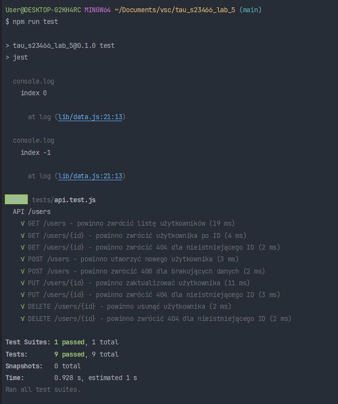
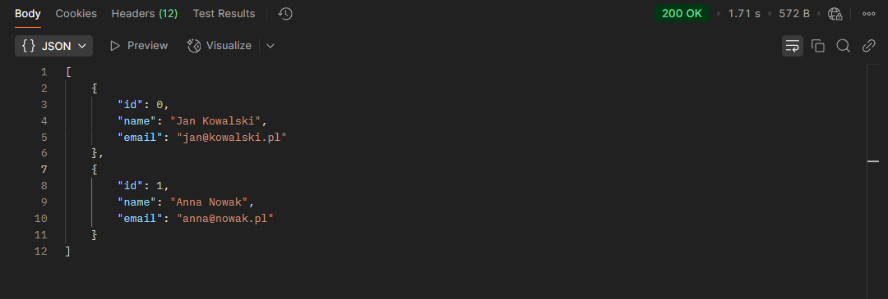
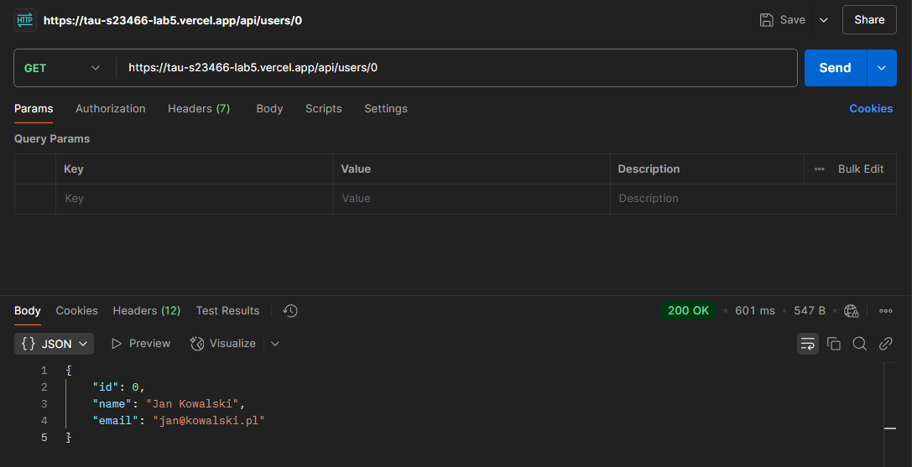
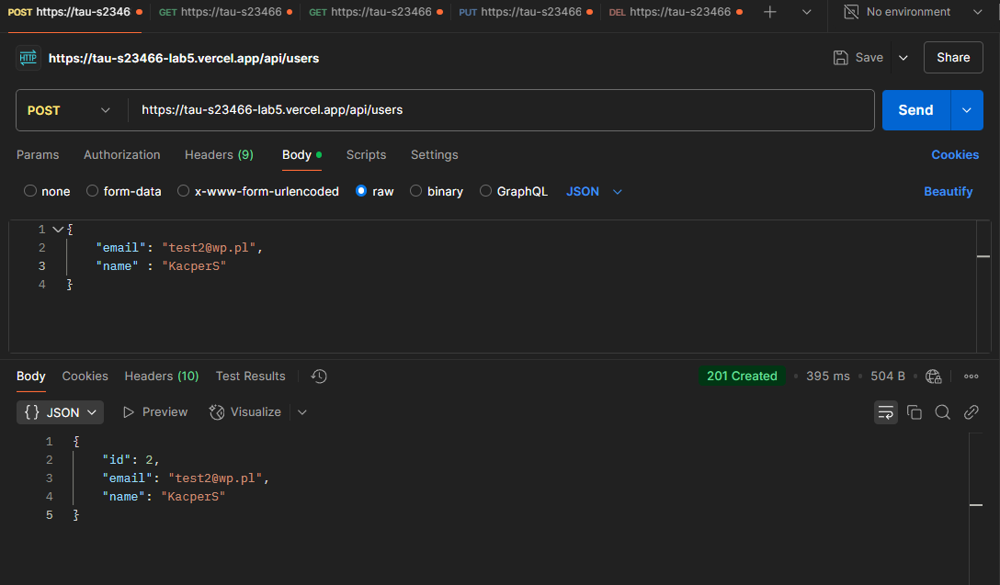
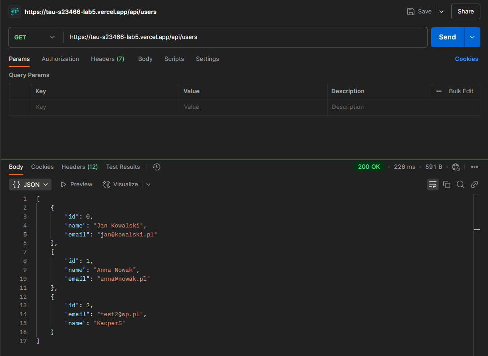
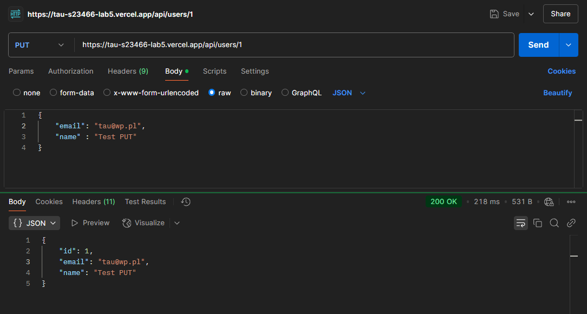
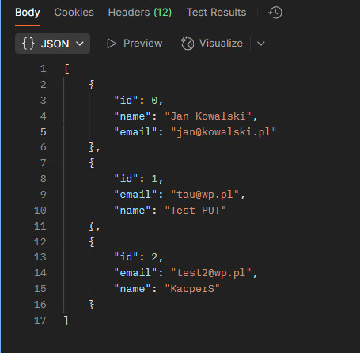
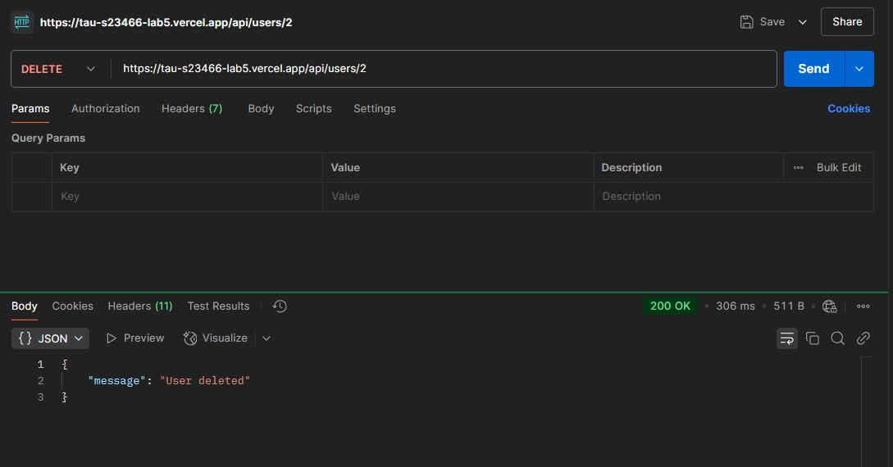
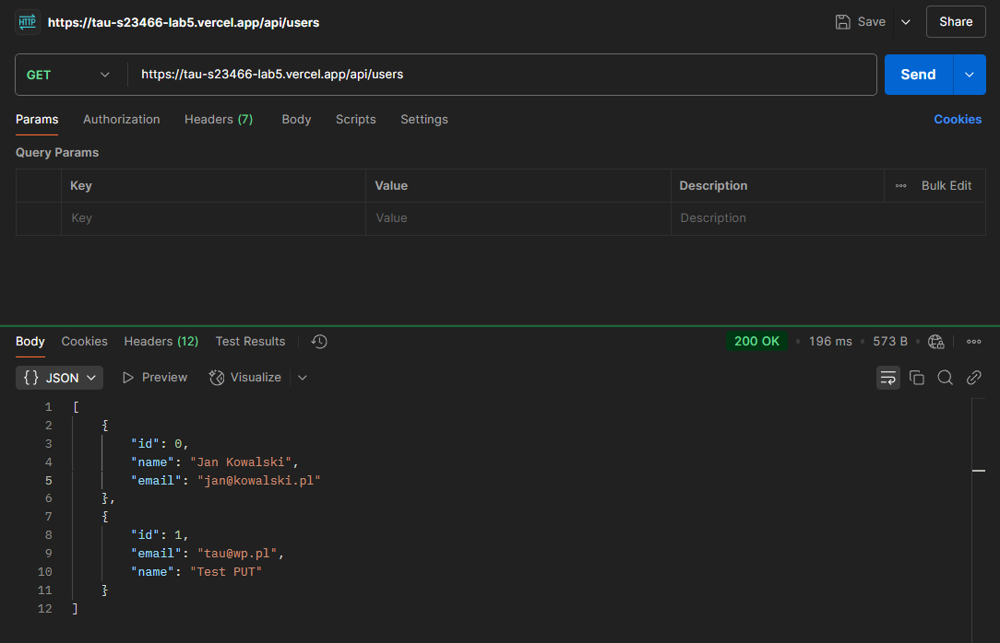

This is a [Next.js](https://nextjs.org) project bootstrapped with [`create-next-app`](https://github.com/vercel/next.js/tree/canary/packages/create-next-app).

# Laboratorium 5 - API

Kacper Sewruk
s23466

Projekt API został stworzony w ramach zajęć laboratoryjnych. Celem projektu było zaimplementowanie prostego interfejsu API do zarządzania użytkownikami. Projekt obsługuje następujące operacje:


- **GET /users**: Pobiera listę wszystkich użytkowników.
- **GET /users/{id}**: Pobiera szczegóły użytkownika na podstawie identyfikatora.
- **POST /users**: Dodaje nowego użytkownika.
- **PUT /users/{id}**: Aktualizuje dane istniejącego użytkownika.
- **DELETE /users/{id}**: Usuwa użytkownika na podstawie identyfikatora.

## Technologie
- **Next.js 15**: Framework użyty do obsługi API.
- **Jest**: Framework testowy do weryfikacji poprawności API.
- **Supertest**: Narzędzie do wykonywania testów integracyjnych API.


## Testowanie API oraz Wyniki Testów

### Wyniki Testów JEST




### Wyniki Testów oraz kod źródłowy

```javascript
import request from "supertest";
import { createServer } from "http";
import { parse } from "url";
import * as usersRoute from "@/app/api/users/route";
import * as userByIdRoute from "@/app/api/users/[id]/route";


const createHandlerServer = (handler, method, path, body = null, context = {}) => {
    return createServer(async (req, res) => {
        const parsedUrl = parse(path, true);
        req.query = parsedUrl.query;
        req.method = method;
        req.headers["content-type"] = "application/json";

        req.json = async () => JSON.parse(body ? JSON.stringify(body) : "{}");

        const response = await handler(req, { params: context.params });

        response.headers.forEach((value, key) => res.setHeader(key, value));
        res.writeHead(response.status, { "Content-Type": response.headers.get("content-type") });

        if (response.body instanceof ReadableStream) {
            const reader = response.body.getReader();
            const decoder = new TextDecoder();
            let chunk;
            while (!(chunk = await reader.read()).done) {
                res.write(decoder.decode(chunk.value));
            }
            res.end();
        } else {
            res.end(response.body ? JSON.stringify(response.body) : null);
        }
    });
};


describe("API /users", () => {
    it("GET /users - powinno zwrócić listę użytkowników", async () => {
        const server = createHandlerServer(usersRoute.GET, "GET", "/api/users");
        const res = await request(server).get("/api/users");
        expect(res.statusCode).toBe(200);
        expect(Array.isArray(res.body)).toBe(true);
    });

    it("GET /users/{id} - powinno zwrócić użytkownika po ID", async () => {
        const server = createHandlerServer(userByIdRoute.GET, "GET", "/api/users/0", null, {
            params: { id: "0" },
        });
        const res = await request(server).get("/api/users/0");
        expect(res.statusCode).toBe(200);
        expect(res.body).toHaveProperty("name", "Jan Kowalski");
    });

    it("GET /users/{id} - powinno zwrócić 404 dla nieistniejącego ID", async () => {
        const server = createHandlerServer(userByIdRoute.GET, "GET", "/api/users/999", null, {
            params: { id: "999" },
        });
        const res = await request(server).get("/api/users/999");
        expect(res.statusCode).toBe(404);
        expect(res.body).toHaveProperty("message", "User not found");
    });

    it("POST /users - powinno utworzyć nowego użytkownika", async () => {
        const server = createHandlerServer(usersRoute.POST, "POST", "/api/users", {
            name: "Nowy Użytkownik",
            email: "nowy@uzytkownik.pl",
        });
        const res = await request(server).post("/api/users").send({
            name: "Nowy Użytkownik",
            email: "nowy@uzytkownik.pl",
        });
        expect(res.statusCode).toBe(201);
        expect(res.body).toHaveProperty("id");
    });

    it("POST /users - powinno zwrócić 400 dla brakujących danych", async () => {
        const server = createHandlerServer(usersRoute.POST, "POST", "/api/users", {});
        const res = await request(server).post("/api/users").send({});
        expect(res.statusCode).toBe(400);
        expect(res.body).toHaveProperty("message", "Name and email are required fields");
    });

    it("PUT /users/{id} - powinno zaktualizować użytkownika", async () => {
        const server = createHandlerServer(userByIdRoute.PUT, "PUT", "/api/users/0", {
            name: "Zaktualizowany Jan",
            email: "zaktualizowany@kowalski.pl",
        }, {
            params: { id: "0" },
        });
        const res = await request(server).put("/api/users/0").send({
            name: "Zaktualizowany Jan",
            email: "zaktualizowany@kowalski.pl",
        });
        expect(res.statusCode).toBe(200);
        expect(res.body).toHaveProperty("name", "Zaktualizowany Jan");
    });

    it("PUT /users/{id} - powinno zwrócić 404 dla nieistniejącego ID", async () => {
        const server = createHandlerServer(userByIdRoute.PUT, "PUT", "/api/users/999", {
            name: "Zaktualizowany Użytkownik",
            email: "nowy@uzytkownik.pl",
        }, {
            params: { id: "999" },
        });
        const res = await request(server).put("/api/users/999").send({
            name: "Zaktualizowany Użytkownik",
            email: "nowy@uzytkownik.pl",
        });
        expect(res.statusCode).toBe(404);
        expect(res.body).toHaveProperty("message", "User not found");
    });

    it("DELETE /users/{id} - powinno usunąć użytkownika", async () => {
        const server = createHandlerServer(userByIdRoute.DELETE, "DELETE", "/api/users/0", null, {
            params: { id: "0" },
        });
        const res = await request(server).delete("/api/users/0");
        expect(res.statusCode).toBe(200);
        expect(res.body).toHaveProperty("message", "User deleted");
    });

    it("DELETE /users/{id} - powinno zwrócić 404 dla nieistniejącego ID", async () => {
        const server = createHandlerServer(userByIdRoute.DELETE, "DELETE", "/api/users/999", null, {
            params: { id: "999" },
        });
        const res = await request(server).delete("/api/users/999");
        expect(res.statusCode).toBe(404);
        expect(res.body).toHaveProperty("message", "User not found");
    });
});

```


### Testowanie za pomocą Postmana


- GET `https://tau-s23466-lab5.vercel.app`/users



- GET `https://tau-s23466-lab5.vercel.app`/users/{id}


- POST `https://tau-s23466-lab5.vercel.app`/users




- PUT `https://tau-s23466-lab5.vercel.app`/users/{id}




- DELETE `https://tau-s23466-lab5.vercel.app`/users/{id}





## API

### /api/users/route.js
```javascript
import {NextResponse} from "next/server";
import {
    addUser,
    getUsers
} from "@/lib/data";


export async function GET(req, res) {
    try {
        return NextResponse.json(getUsers())
    } catch (e) {
        return NextResponse.json({
            status: "error",
            message: e
        });
    }
}

export async function POST(req, res) {
    const body = await req.json();

    try {
        const {email, name} = body;

        if (!email || !name) {
            return NextResponse.json({
                    message: "Name and email are required fields"
                },
                {status: 400}
            );
        }

        const newUser = addUser(body);
        return NextResponse.json(newUser, {status: 201})
    } catch (e) {
        return NextResponse.json({
                message: e.message
            },
            {status: 400}
        );
    }
}
```


### /api/users/[id]/route.js
```javascript
import {NextResponse} from "next/server";
import {deleteUser, getUserById, updateUser} from "@/lib/data";

export async function GET(request, context) {

    const {params} = context;
    const id = params.id;
    const findId = parseInt(id);

    try {

        if (id < 0) {
            return NextResponse.json({
                    message: "Invalid id"
                },
                {
                    status: 400,
                });
        }

        const user = getUserById(findId);
        if (!user) {
            return NextResponse.json({
                    message: "User not found"
                },
                {status: 404}
            );

        }
        return NextResponse.json(user)
    } catch (e) {
        return NextResponse.json({
            status: "error",
            message: e.message
        });
    }
}

export async function PUT(req, context) {
    const {params} = context;
    const body = await req.json();

    const id = await params.id;
    const findId = parseInt(id);
    try {
        if (id < 0) {
            return NextResponse.json({
                    message: "Invalid id"
                },
                {
                    status: 400
                }
            );
        }
        const updatedUser = updateUser(findId, body)
        if (!updatedUser) {
            return NextResponse.json({
                    message: "User not found"
                },
                {status: 404}
            );
        }
        return NextResponse.json(updatedUser, {status: 200});
    } catch (e) {
        return NextResponse.json({message: e.message}, {status: 400})
    }
}

export async function DELETE(request, context) {
    const {params} = context;
    const id = params.id;
    const findId = parseInt(id);
    try {
        if (id < 0) {
            return NextResponse.json({
                    message: "Invalid id"
                },
                {
                    status: 400
                }
            );
        }
        const user = deleteUser(findId);
        if (!user) {
            return NextResponse.json({
                    message: "User not found"
                },
                {status: 404}
            );
        }
        return NextResponse.json({message: "User deleted"}, {status: 200});
    } catch (e) {
        return NextResponse.json({message: e.message}, {status: 400})
    }
}
```


### /lib/data.js
```javascript
let users = [
    {id: 0, name: "Jan Kowalski", email: "jan@kowalski.pl"},
    {id: 1, name: "Anna Nowak", email: "anna@nowak.pl"},
]

export const getUsers = () => users;

export const getUserById = (id) => users.find((user) => user.id === id);

export const addUser = (user) => {
    const newUser = {
        id: users.length,
        ...user,
    }
    users.push(newUser);
    return newUser;
}

export const updateUser = (id, user) => {
    const index = users.findIndex(user => user.id === id );
    console.log("index", index)
    if (index === -1) {
        return null;
    }
    users[index] = {id, ...user};
    return users[index];
}

export const deleteUser = (id) => {
    const findUser = users.find((u) => u.id === id)
    if (!findUser) {
        return null
    }
    return users = users.filter((u) => u.id !== id)
}
```